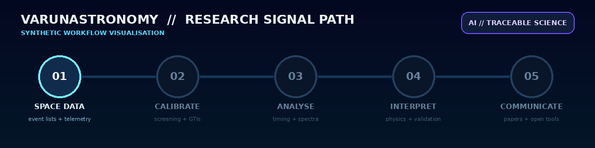
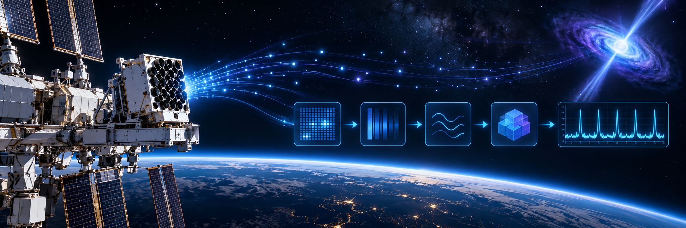
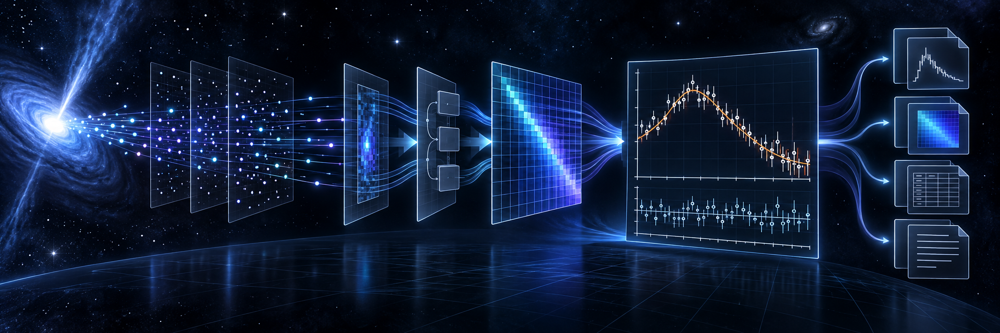
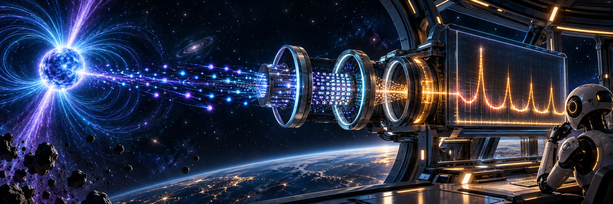
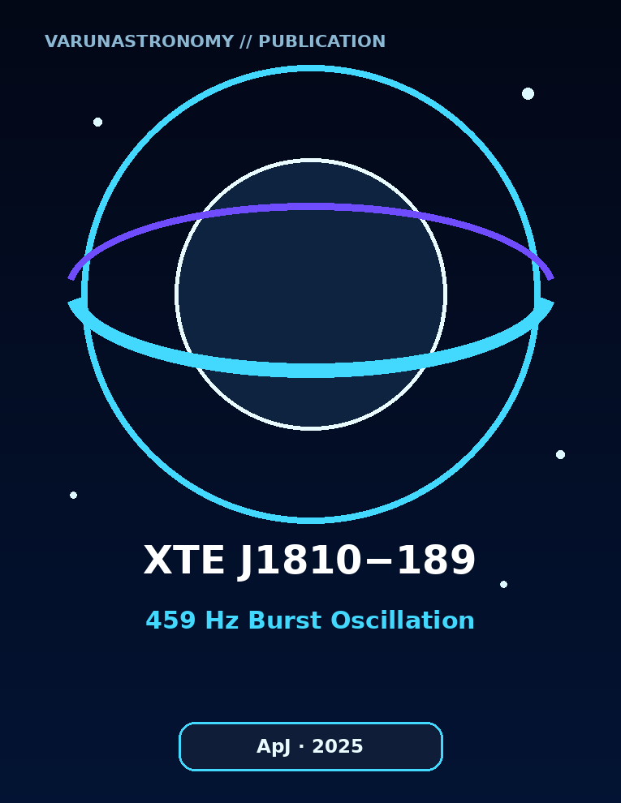
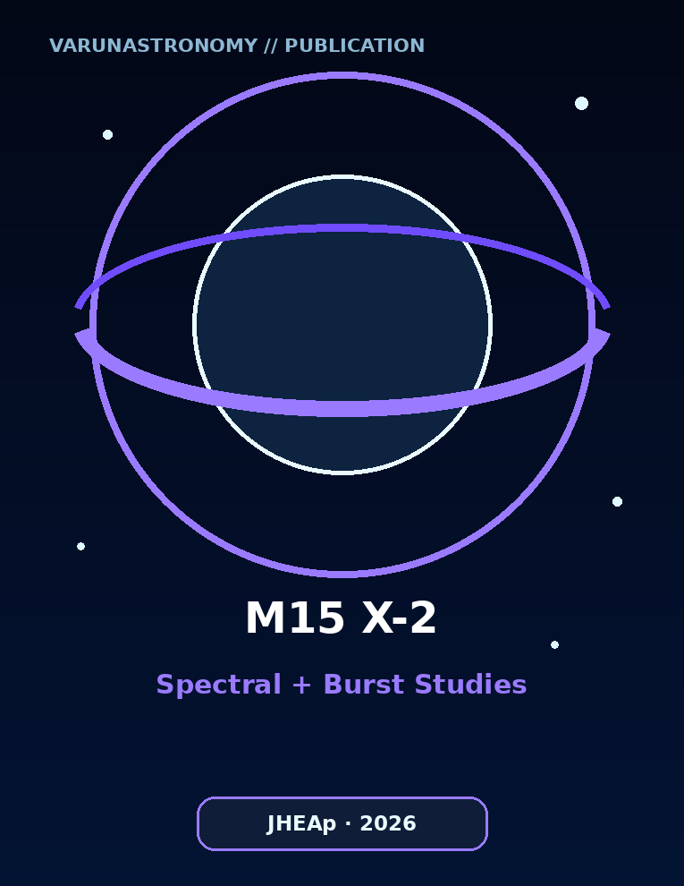
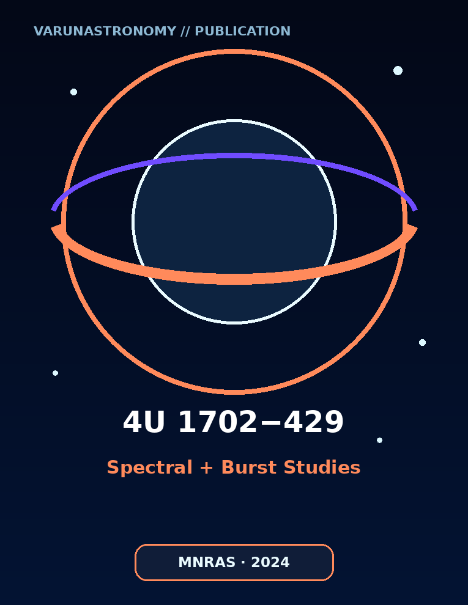
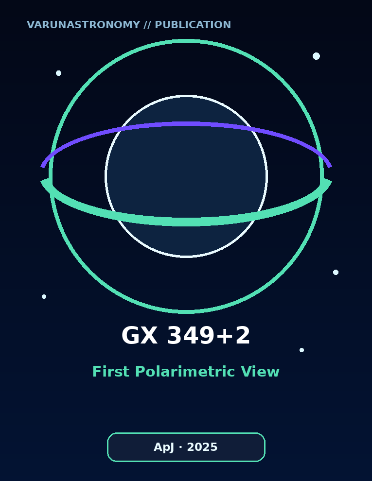

<div align="center">
  

  # varunastronomy // Cosmic Data to Scientific Discovery 🚀

  **Computational Astrophysicist · Scientific Python Developer · PhD Research Scholar**  
  **CHRIST (Deemed to be University), Bengaluru, India**

  [](https://github.com/varunastronomy)
</div>

## 🧑‍🚀 About this researcher

I turn space-mission observations into reproducible scientific results. My work focuses on neutron-star low-mass X-ray binaries, thermonuclear X-ray bursts, burst oscillations, quasi-periodic oscillations, spectral modelling, and X-ray polarimetry. I build Python and Linux workflows that carry an observation from calibrated event data to timing products, spectra, physical interpretation, and publication.

I am currently completing a PhD in Physics at **CHRIST (Deemed to be University), Bengaluru, India**, while moving toward research-software, data-science, IT, and space-sector roles where careful scientific computing matters.

```text
incoming photons  →  calibrated events  →  timing + spectra  →  tested physics  →  useful knowledge
       🛰️                    ⚙️                    📊                 🧠                 🌌
```

## 🤖 Research signal path

<div align="center">
  
  <br><sub><b>Synthetic workflow visualisation:</b> a conceptual portfolio animation, not observational data.</sub>
</div>

## 🛰️ Mission-control stack

<p align="center">
  
  
  
  
  
  
  
  
  
  
  
  
</p>

**Research domains:** X-ray timing · broadband spectroscopy · thermonuclear bursts · QPO and oscillation searches · polarimetry · statistical inference · pipeline automation · reproducible data analysis

**Mission experience:** NICER · NuSTAR · AstroSat · RXTE · Insight-HXMT · XPoSat · IXPE

## 🧪 Featured research software

<table>
  <tr>
    <td width="25%" valign="top">
      <a href="https://github.com/varunastronomy/varun-custom-nicer-pipeline"></a>
      <h3 align="center">🛰️ Varun's Custom NICER Pipeline</h3>
      <p>A resilient observation-by-observation reduction workflow with explicit failure reporting and continuation logic.</p>
      <p align="center"><a href="https://github.com/varunastronomy/varun-custom-nicer-pipeline"><b>Open repository →</b></a></p>
    </td>
    <td width="25%" valign="top">
      <a href="https://github.com/varunastronomy/spectral-product-generation"></a>
      <h3 align="center">📡 Spectral Product Generation</h3>
      <p>The next pipeline stage: source/background spectra and instrument-response products for scientific modelling.</p>
      <p align="center"><a href="https://github.com/varunastronomy/spectral-product-generation"><b>Open repository →</b></a></p>
    </td>
    <td width="25%" valign="top">
      <a href="https://github.com/varunastronomy/photonforge-xray-light-curves"></a>
      <h3 align="center">🤖 PhotonForge</h3>
      <p>A concurrent, GTI-aware workflow for source, background, and net X-ray light-curve products.</p>
      <p align="center"><a href="https://github.com/varunastronomy/photonforge-xray-light-curves"><b>Open repository →</b></a></p>
    </td>
    <td width="25%" valign="top">
      <a href="https://github.com/varunastronomy/burstscope-xray-characterisation"></a>
      <h3 align="center">⚡ BurstScope</h3>
      <p>Scientific characterisation of X-ray bursts, with carefully documented definitions, outputs, and interpretation boundaries.</p>
      <p align="center"><a href="https://github.com/varunastronomy/burstscope-xray-characterisation"><b>Open repository →</b></a></p>
    </td>
  </tr>
</table>

## 📚 Selected publications

### First-author research

<table>
  <tr>
    <td width="180" align="center"><a href="https://doi.org/10.3847/1538-4357/ae21d3"></a></td>
    <td valign="top"><h3>⚡ Discovery of a 459 Hz Burst Oscillation in XTE J1810−189 with NICER</h3><b>M. Varun</b>, Neal Titus Thomas, S. B. Gudennavar, and S. G. Bubbly<br><i>The Astrophysical Journal</i>, <b>995</b>(2), 153 (2025)<br><br><a href="https://doi.org/10.3847/1538-4357/ae21d3"><b>DOI → 10.3847/1538-4357/ae21d3</b></a></td>
  </tr>
  <tr>
    <td width="180" align="center"><a href="https://doi.org/10.1016/j.jheap.2025.100461"></a></td>
    <td valign="top"><h3>🌌 Spectral and Type I X-ray Burst Studies of M15 X-2 Using NICER Observations</h3><b>M. Varun</b>, Neal Titus Thomas, L. Giridharan, S. B. Gudennavar, and S. G. Bubbly<br><i>Journal of High Energy Astrophysics</i>, <b>49</b>, 100461 (2026)<br><br><a href="https://doi.org/10.1016/j.jheap.2025.100461"><b>DOI → 10.1016/j.jheap.2025.100461</b></a></td>
  </tr>
  <tr>
    <td width="180" align="center"><a href="https://doi.org/10.1093/mnras/stae636"></a></td>
    <td valign="top"><h3>🔥 Spectral and Type I X-ray Burst Studies of 4U 1702−429 Using AstroSat Observations</h3><b>M. Varun</b>, Neal Titus Thomas, S. B. Gudennavar, and S. G. Bubbly<br><i>Monthly Notices of the Royal Astronomical Society</i>, <b>529</b>(3), 2234–2241 (2024)<br><br><a href="https://doi.org/10.1093/mnras/stae636"><b>DOI → 10.1093/mnras/stae636</b></a></td>
  </tr>
</table>

### Co-authored research

<table>
  <tr>
    <td width="180" align="center"><a href="https://doi.org/10.3847/1538-4357/add330"></a></td>
    <td valign="top"><h3>🧭 First Polarimetric View of GX 349+2 with the Imaging X-Ray Polarimetry Explorer</h3>S. Lavanya, L. Giridharan, Neal Titus Thomas, Khushi Jirawala, <b>M. Varun</b>, S. B. Gudennavar, and S. G. Bubbly<br><i>The Astrophysical Journal</i>, <b>985</b>(2), 229 (2025)<br><br><a href="https://doi.org/10.3847/1538-4357/add330"><b>DOI → 10.3847/1538-4357/add330</b></a></td>
  </tr>
</table>

> Publication metadata and links are maintained against the journal records. The publication thumbnails are visual previews of the corresponding papers.

## 🧠 Principles I work by

> **“Let every result remain traceable—from the final figure back to the photons.”**

> **“Automation creates speed; validation creates science.”**

> **“The best research software does not hide uncertainty. It makes assumptions visible.”**

## 🎯 What I bring to a team

- 🤖 Scientific Python development and automation for real observational datasets
- 🧩 End-to-end problem solving across calibration, data engineering, analysis, and communication
- 📈 Signal processing, time-series analysis, spectral modelling, and statistical reasoning
- 🐧 Reproducible Linux workflows designed for auditability and graceful failure
- ✍️ Peer-reviewed research writing with close attention to scientific wording
- 🌍 Experience translating mission data into tools, physical insight, and publication-ready outputs

## 📡 Open to opportunities

I am exploring roles in **space science, research software engineering, scientific data science, Python development, mission-data operations, and technical R&D**. If your team works where software meets complex data and real-world discovery, I would be glad to connect.

<div align="center">

### Follow the research on GitHub 📡

[](https://github.com/varunastronomy)

`observe` → `question` → `code` → `test` → `discover` 🚀

<sub>Profile artwork created for this portfolio. Repository-specific scientific-use, citation, and permission terms are documented inside each project.</sub>

</div>
